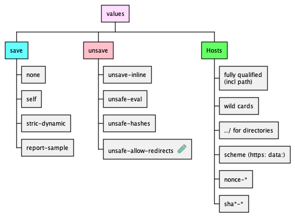

# Content-Security-Policy Tester

Helper server to try different combinations of CSP with different web pages

Runs a HTTP server, serving resources from the `resources/webroot` directory and adds
a Content-security-policy from `resources/csp`

The CSP are organized as files with one policy per line for ease of edit.
Linefeeds are filtered out before sending back

Pull-Requests (incl. new sample files or policy files) are welcome

Details on CSP can be found [at the Mozilla Developer Network](https://developer.mozilla.org/en-US/docs/Web/HTTP/CSP)

List of directives
</object>

Content security values
</object>

## Running the project

- you need [maven](https://maven.apache.org) installed
- clone the repository
- open folder
- run `mvn clean compile exec:java

## Not designed to be deployed
